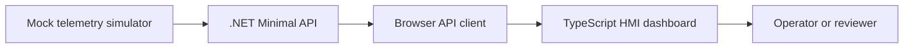

# Architecture Notes

## Domain Concept

Industrial HMI/SCADA applications help operators monitor and control equipment. This prototype focuses on a small monitoring slice:

- Equipment units represent machines, lines, pumps, tanks, or controllers.
- Telemetry readings represent process values such as temperature, pressure, speed, and utilization.
- Alarm rules convert readings into operator-visible states.
- The UI presents a fast operational summary, equipment table, and active alarm list.

## Prototype Boundaries

This is not a real SCADA system and does not connect to PLCs. It is a web application prototype that models the same kind of data flow at a safe portfolio scale.

## Backend Shape

The API source is organized around plain models and focused endpoints:

- `/api/equipment` returns configured equipment.
- `/api/telemetry/latest` returns current readings.
- `/api/alarms/active` returns active alarms.
- `/api/dashboard/snapshot` returns summary, readings, and alarms from one coherent backend sample.
- `/health` returns service health.

## Frontend Shape

The frontend keeps domain logic separate from rendering logic:

- Domain functions classify readings and summarize plant state.
- The API client loads backend-owned dashboard snapshots.
- The mock telemetry module simulates changing process values only when the API is unavailable.
- The app module renders the dashboard and updates it on a timer.

This separation keeps the browser focused on presentation while the backend becomes the contract owner for telemetry and alarms.
