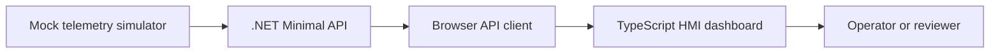

# Architecture Notes

## Domain Concept

Industrial HMI/SCADA applications help operators monitor and control equipment. This prototype focuses on a small monitoring slice:

- Equipment units represent machines, lines, pumps, tanks, or controllers.
- Telemetry readings represent process values such as temperature, pressure, speed, and utilization.
- Alarm rules convert readings into operator-visible states.
- The UI presents a fast operational summary, equipment table, and active alarm list.

## Prototype Boundaries

This is not a real SCADA system and does not connect to PLCs. It is a web application prototype that models the same kind of data flow at a safe portfolio scale.

## Backend Shape

The API source is organized around plain models and focused endpoints:

- `/api/equipment` returns configured equipment.
- `/api/telemetry/latest` returns current readings.
- `/api/alarms/active` returns active alarms.
- `/api/alarms/acknowledge` records operator acknowledgement for active alarms.
- `/api/dashboard/snapshot` returns summary, readings, and alarms from one coherent backend sample.
- `/api/dashboard/stream` emits live dashboard snapshots as Server-Sent Events.
- `/health` returns service health.

## Frontend Shape

The frontend keeps domain logic separate from rendering logic:

- Domain functions classify readings and summarize plant state.
- The API client subscribes to backend-owned dashboard snapshots and falls back to polling.
- The mock telemetry module simulates changing process values only when the API is unavailable.
- The app module renders the dashboard from stream, polling, or simulator snapshots.

This separation keeps the browser focused on presentation while the backend becomes the contract owner for telemetry and alarms.

## Live Updates

The dashboard uses Server-Sent Events for live monitoring updates. SSE is a good
fit at this stage because telemetry flows from backend to browser, works with
native `EventSource`, and keeps the project dependency-light. If future operator
control actions need bidirectional low-latency messaging, this stream boundary
can evolve to SignalR or WebSockets without changing the dashboard snapshot
contract.

## Alarm Lifecycle

Alarm rules still evaluate from the latest telemetry sample, but lifecycle state
is backend-owned. The lifecycle service preserves the original raised time,
records acknowledgement metadata, and marks alarms cleared when the triggering
condition disappears. This is intentionally in-memory for now; the historian and
audit branches should move this state into durable storage.
